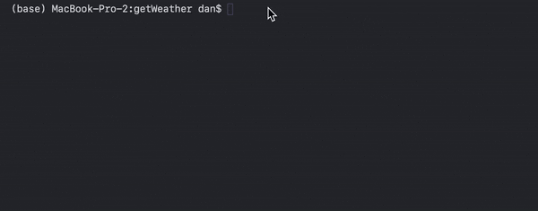

After deciding to become a Gopher, I have been learning how to handle JSON in Go.

Coming from a Node.js background (where handling the conversion between JSON and JS objects is easy) I just needed to have a simple project to put what I'd learnt into practice, no tutorials, no guides, just figuring shit out as I go. The major difference is creating structs to marshal the json data in and out of. Obviously JS isn't typed, so learning how to use Go's type system has been really interesting.

This weather app is given (in JavaScript) as a project to students at Code Nation, so I was well versed with the architecture.

I wrote a simple REST client to make http requests, using Go's built in http package.

The first API call (to Mapbox) takes a location string and returns the latitude and longitude for that place. The lat and lng coordinates are then sent to the Darksky API to return the weather.

I was able to (lightly) look at using Goroutines and Channels to wait for data to be returned from threads.
